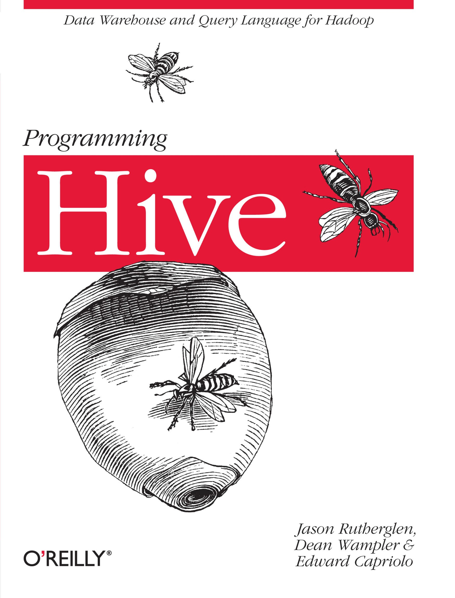
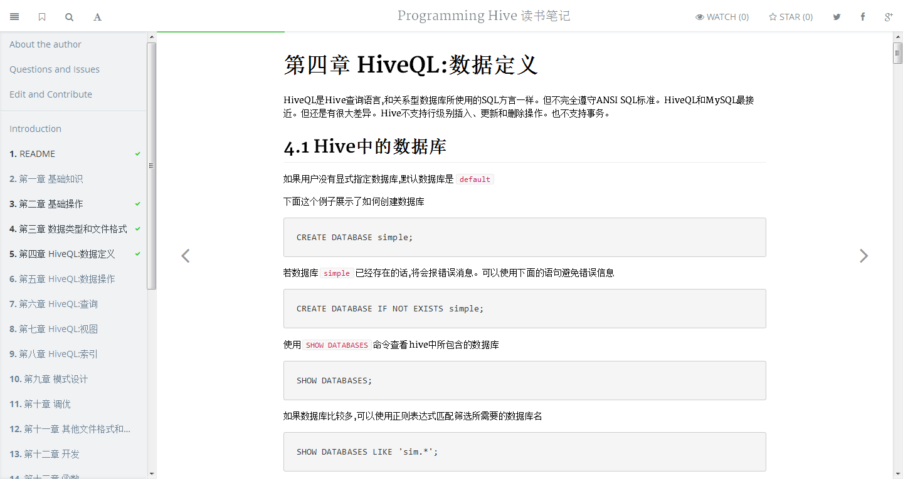

# Programming Hive 读书笔记



该项目使用[GitbookIO](https://github.com/GitbookIO/gitbook)。关于```GitbookIO```的详细信息,请参考官方文档。

# 在本地快速阅读

* 克隆本项目到本地硬盘

```bash
$ git clone https://github.com/sxyx2008/programminghive.git
```

* 使用npm安装```gitbook```

```
$ npm install gitbook -g
```

注意```-g```选项。将```gitbook```安装为全局。

* 切换到programminghive的目录

```
$ cd programminghive
```
* 打开命令行或终端,执行下面的操作

```
$ gitbook serve .

```

如:

```bash
$ gitbook serve .
Press CTRL+C to quit ...

Live reload server started on port: 35729
Starting build ...
Successfuly built !

Starting server ...
Serving book on http://localhost:4000
```

接下来,你懂得。。。


# [开始阅读](http://aimeizi.net/programminghive/)





# 与我联系

QQ:184675420

Mail:sxyx2008@163.com

Weibo:[http://weibo.com/qq184675420](http://weibo.com/qq184675420)

WebSite:[aimeizi.net](http://aimeizi.net)

GitHub:[https://github.com/sxyx2008](https://github.com/sxyx2008)


# License

MIT

Copyright (c) 2014 雪山飞鹄